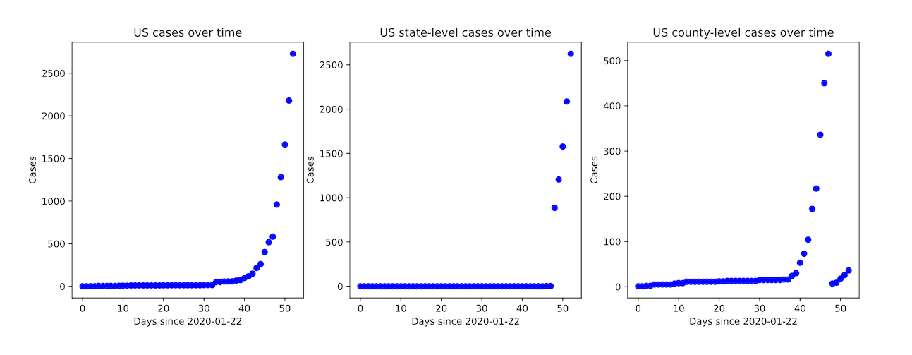

# covid-19-growth

The Johns Hopkins University Center for Systems Science and Engineering is providing
[daily COVID-19 CSV files](https://github.com/CSSEGISandData/COVID-19) containing the data that are
displayed on their
[ArcGIS dashboard for COVID-19](https://gisanddata.maps.arcgis.com/apps/opsdashboard/index.html#/bda7594740fd40299423467b48e9ecf6).
This repo aims to provide a sensible starting point and some useful functions for reporting/analysis/modeling
 using the JH COVID-19 data. The latest JH CSV files are pulled from GitHub at runtime.

For VSCode users, available as a self-contained, system-independent environment using Docker Remote with Jupyter Notebook integration.


## Installing
### Vanilla
Clone and set up your Python environmet. For Virtualenv, just copy/paste:
```
git clone https://github.com/willhaslett/covid-19-growth.git
cd covid-19-growth
virtualenv venv
source venv/bin/activate
pip install -q -r requirements.txt

```
Verify installation
```
$ python lib/tests.py

Updated pickle file pickles/df_all.p with global data
Updated pickle file pickles/df_us.p with all US data

Global cases (head):
        date  day  cases province_state    country      lat      long
0 2020-01-22    0      2            NaN   Thailand  15.0000  101.0000
1 2020-01-22    0      2            NaN      Japan  36.0000  138.0000
2 2020-01-22    0      0            NaN  Singapore   1.2833  103.8333
3 2020-01-22    0      0            NaN      Nepal  28.1667   84.2500
4 2020-01-22    0      0            NaN   Malaysia   2.5000  112.5000

...

US Recovered (head):
        date  day          state county territory             other    sub_region     region  is_state      lat      long  population  cases
0 2020-01-22    0     Washington   None      None              None       pacific       west      True  47.4009 -121.4905   7614893.0      0
1 2020-01-22    0       New York   None      None              None  mid_atlantic  northeast      True  42.1657  -74.9481  19453561.0      0
2 2020-01-22    0     California   None      None              None       pacific       west      True  36.1162 -119.6816  39512223.0      0
3 2020-01-22    0  Massachusetts   None      None              None   new_england  northeast      True  42.2302  -71.5301   6892503.0      0
4 2020-01-22    0           None   None      None  Diamond Princess          None       None     False  35.4437  139.6380         NaN      0

Pickle files for global and US data are up-to-date with the Johns Hopkins CSV files
`python c19us.py` (~10 seconds) refreshes both pickles
`python c19all.py` (snappy) refreshes the global pickle
Tests passed

$
```

### VSCode/Docker
Have the [VSCode extension for Remote Development](https://marketplace.visualstudio.com/items?itemName=ms-vscode-remote.vscode-remote-extensionpack) installed. Here 'remote' means in a local Docker container (Debian).

In VSCode, [Open the project folder in a container](https://code.visualstudio.com/docs/remote/containers#_quick-start-open-an-existing-folder-in-a-container)

Verify the installation as above.

## Usage

### `c19all.py`
* `df_all` A dictionary containing dataframes with all global data for cases, deaths, and recoveries. `province_state` has mixed types, as it does upstream.
  ```
  print(df_all['cases'])

              date  day  cases  province_state              country      lat      long
  0     2020-01-22    0      2             NaN             Thailand  15.0000  101.0000
  1     2020-01-22    0      2             NaN                Japan  36.0000  138.0000
  2     2020-01-22    0      0             NaN            Singapore   1.2833  103.8333
  3     2020-01-22    0      0             NaN                Nepal  28.1667   84.2500
  4     2020-01-22    0      0             NaN             Malaysia   2.5000  112.5000
  ...          ...  ...    ...             ...                  ...      ...       ...
  21887 2020-03-13   51      2             NaN                Aruba  12.5211  -69.9683
  21888 2020-03-13   51      2  Grand Princess               Canada  37.6489 -122.6655
  21889 2020-03-13   51      1             NaN                Kenya  -0.0236   37.9062
  21890 2020-03-13   51      1             NaN  Antigua and Barbuda  17.0608  -61.7964
  21891 2020-03-13   51      5         Alabama                   US  32.3182  -86.9023
  
  [21892 rows x 7 columns] 
  ```

* Functions
  - `filter(df, column, vlaue)` Generic filter
  - `for_country(df, country)` Filter by country
  - `for_province_state(df, province_state)` Filter by province_state
  - `sum_by_date(df)` Group by date and sum case counts 

### `c19us.py`
* `df_us` A dictionary with dataframes for US cases, deaths, and recoveries. Mixed location data
from upstream are parsed into idividual columns for different location types. For state-level data,
sub_region, region, and population are added.
  ```
              date  day  cases          state     county       territory             other is_state      lat      long          sub_region     region  population
  0     2020-01-22    0      0     Washington       None            None              None     True  47.4009 -121.4905             pacific       west   7614893.0
  1     2020-01-22    0      0       New York       None            None              None     True  42.1657  -74.9481        mid_atlantic  northeast  19453561.0
  2     2020-01-22    0      0     California       None            None              None     True  36.1162 -119.6816             pacific       west  39512223.0
  3     2020-01-22    0      0  Massachusetts       None            None              None     True  42.2302  -71.5301         new_england  northeast   6892503.0
  4     2020-01-22    0      0           None       None            None  Diamond Princess    False  35.4437  139.6380                 NaN        NaN         NaN
  ...          ...  ...    ...            ...        ...             ...               ...      ...      ...       ...                 ...        ...         ...
  13333 2020-03-15   53      0       Delaware  NewCastle            None              None    False  39.5393  -75.6674                 NaN        NaN         NaN
  13334 2020-03-15   53     12        Alabama       None            None              None     True  32.3182  -86.9023  east_south_central      south   4903185.0
  13335 2020-03-15   53      3           None       None     Puerto Rico              None    False  18.2208  -66.5901                 NaN        NaN         NaN
  13336 2020-03-15   53      1           None       None  Virgin Islands              None    False  18.3358  -64.8963                 NaN        NaN         NaN
  13337 2020-03-15   53      3           None       None            Guam              None    False  13.4443  144.7937                 NaN        NaN         NaN

  [13338 rows x 13 columns]
  ```

* `df_us.p` is a pickle file that stores the `df_us` dictionary. `c19us.py` takes about 10 seconds to run, so you may want to use the pickle for downstream work rather than importing the `c19us.py` module. Note however that the `df_us.p` pickle goes stale when new data are posted in the JH repo. Pickles do go stale.

* How to work at the state level: Reporting regions for US data have been evolving over time. As shown in the figure below, the makeup of overall US data between counties and states has been shifting toward the state level. For state-level analyses, you can rely on the `state` column in the `df_us` dataframes. It is populated for both state-level records and for county-level records. To work with state-level records only, filter on the boolean `is_state` column.

  
  
* Jupyter Notebooks
  
  `all.ipynb` and `us.ipynb` contain starting points for work with global or US data.

## License

This project is licensed under the MIT License. See the [LICENSE.md](LICENSE.md) file for details

## Acknowledgments

The Johns Hopkins University Center for Systems Science and Engineering is doing a great public service by sharing these data.
